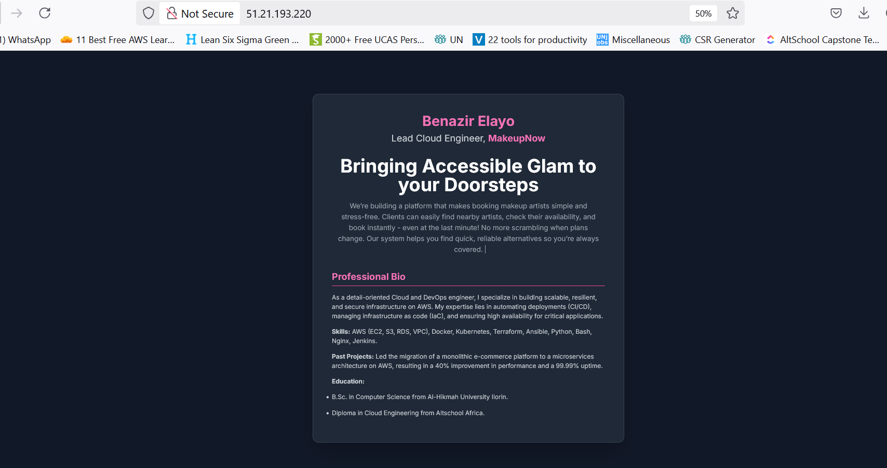

# AltSchool Second Semester Exam

## Hosted Link
http://51.21.193.220

## Project Summary
Deployed a personalized landing page on AWS EC2 with Ubuntu and Nginx. The project includes my startup idea, a short pitch of it, and a professional bio.

## Features
- An EC2 instance (t3.micro)
- Operating System: Ubuntu Server 22.04 LTS
- Nginx web server
- HTML landing page with Tailwind CSS

## Steps Taken

### 1. EC2 Setup
- I created an AWS account, using the Free Tier.
- Launched an EC2 instance from the AWS Management Console.
- AMI (Amazon Machine Image): Ubuntu Server 22.04 LTS was chosen for its stability, free tier and widespread support.
- Instance Type: t3.micro was selected to stay within the AWS Free Tier.
- Key Pair: A new .pem key pair was generated and securely saved in the same folder as my vagrantfile to allow for secure SSH access via terminal.
- Security Group: Configured the instance's firewall to allow traffic on the following ports:
  
    Port 22 (SSH): To allow remote terminal access for server management.

    Port 80 (HTTP): To allow standard web traffic. 

    Port 443 (HTTPS): To allow secure web traffic if SSL certificate is installed.

### 2. Connecting to the Server

- Using a terminal, a secure connection to the EC2 instance was established via SSH and .pem file
- The permissions of the .pem file were restricted to read-only for the owner as required by SSH for security.

### 3. Web Server Setup
- Installed Nginx.
- The initial "Welcome to nginx!" page was successfully accessed via the public IP, confirming the web server was operational.

### 4. Landing Page 
- An index.html file was created on the server using the nano text editor.

- The HTML content was structured to include my name, role, a project title, a project pitch, and a professional bio.

- Tailwind CSS was linked via a CDN to provide modern styling and a professional look without requiring a local build process.

- The newly created index.html was moved into the Nginx web root (/var/www/html/) and the default Nginx welcome page was removed.

- The Landing Page is now accessible on the web via the EC2 instance Public IP Address.

### 5. Deployment
- Pushed code to GitHub: https://github.com/benazirr-1/AltSchool-Exam

## Evidence

## Author
**Benazir Elayo**  
 Student ID: ALT/SOE/024/4838.
